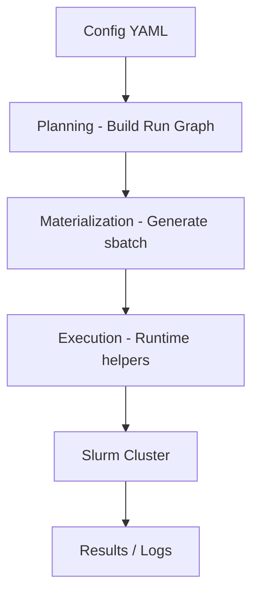

# slurmforge

[](https://pypi.org/project/slurmforge/)

## TL;DR

Define experiments in YAML → generate reproducible Slurm jobs.

```bash
sforge init
sforge validate
sforge generate
sbatch runs/.../sbatch/*.sh
```


`slurmforge` is a Slurm-native AI/ML experiment orchestration toolkit designed for large-scale training workflows.

It helps you:
- expand experiment sweeps from a single config
- generate reproducible Slurm batch jobs
- manage training + evaluation pipelines with minimal boilerplate

It takes one experiment config, expands a sweep, resolves train and eval commands, groups runs by final Slurm resource shape, and materializes the batch records and sbatch files needed for execution.


## Why slurmforge? 

Compared to ad-hoc bash scripts or manual sbatch workflows:

- structured experiment definition (YAML instead of shell glue)
- deterministic sweep expansion
- built-in retry and replay support
- explicit separation of planning vs execution

Unlike general-purpose orchestration tools, slurmforge is designed specifically for Slurm environments.


## Architecture (High-Level)



This separation ensures reproducibility and easier debugging.


## Who This Is For

The following section is intended for users who are new to slurmforge.

You do not need to understand the internal planner or executor model to start. The intended workflow is:

1. keep your real training code in your own project directory
2. generate a starter project with `sforge init`
3. either edit the generated starter scripts or point the config at your existing train and eval entrypoints
4. run `sforge validate`
5. run `sforge generate`
6. submit the generated `sbatch` files


## Install

Install from PyPI:

```bash
pip install slurmforge
```

Or install from source for the latest development version:

```bash
git clone https://github.com/Sean-XinLi/slurmforge
cd slurmforge
python -m venv ../slurmforge_venv
source ../slurmforge_venv/bin/activate
pip install .
```

Main CLI:

```bash
sforge --help
sforge --version          # or sforge -V
```

Most users only need `sforge`. The low-level runtime helpers are invoked automatically by generated batch scripts.

## Quick Start

The recommended newcomer path is `init`.

Create a starter project scaffold (interactive wizard):

```bash
sforge init
```

Or specify type and profile directly:

```bash
sforge init script --out ./demo_project
cd ./demo_project
```

Validate the config first:

```bash
sforge validate --config ./experiment.yaml
```

Preview the generated batch:

```bash
sforge generate --config ./experiment.yaml --dry_run
```

Generate the batch files:

```bash
sforge generate --config ./experiment.yaml
```

Generated batches persist the `slurmforge` version that planned them.
After upgrading `slurmforge`, older batches may still execute or replay with compatibility warnings instead of a hard stop.
For new submissions after an upgrade, regenerate the batch so planning and execution use the same installed version.

Then submit the generated Slurm scripts under:

```text
runs/<project>/<experiment>/batch_<name>/sbatch/
```

## Connect A Starter To Your Code

There are two normal ways to adapt a starter project:

1. Edit the generated scripts in place. Each script is divided into three labelled sections:
   - **Section A — arg contract** `[keep as-is]`: CLI args that slurmforge injects at submission time. Add your own args here; do not remove the contract args.
   - **Section B — your code** `[replace this block]`: the demo placeholder. Delete everything between the `↓↓↓ DEMO PLACEHOLDER` and `↑↑↑ DEMO PLACEHOLDER` markers and insert your real training or eval logic.
   - **Section C — output contract** `[keep as-is]`: writes to `meta_dir` after every run for slurmforge bookkeeping.
2. Keep the generated `experiment.yaml`, but change `model.script` and `eval.script` to point at entrypoint scripts that already exist in your project.

`model.script` should point to the script that launches training, not to a module that only defines layers or model classes.

Typical direct-entrypoint edit:

```yaml
model:
  name: "my_model"
  script: "train.py"

eval:
  enabled: true
  script: "eval.py"
```

Typical existing-project edit:

```yaml
model:
  name: "my_model"
  script: "src/train_my_model.py"

eval:
  enabled: true
  script: "tools/run_eval.py"
```

If you use `script` or `registry` mode, make sure the script named by
`model.script` accepts the arguments declared under `run.args`.

## Starter Modes

Use `init` when you want a starter project scaffold.

`init` takes two orthogonal choices: **type** (how your training code is invoked) and **profile** (cluster complexity).

```bash
sforge init                          # interactive wizard
sforge init script                   # script type, starter profile (default)
sforge init script   --profile hpc   # script type, hpc profile
sforge init command
sforge init command  --profile hpc
sforge init registry
sforge init registry --profile hpc
sforge init adapter
sforge init adapter  --profile hpc
```

Types:
- `script` — train.py-style script; slurmforge manages args and submission
- `command` — wraps a complete shell command in Slurm
- `registry` — uses a shared team model registry
- `adapter` — interface bridge script (advanced)

Profiles:
- `starter` — single GPU, minimal config; runnable immediately after filling in 4 fields
- `hpc` — multi-GPU, sweep, eval, artifact sync; includes placeholders for cluster account, environment activation, and data paths that you replace before execution

Typical generated files:

- `experiment.yaml`
- `README.md`
- `runs/`
- type-specific files such as `train.py`, `eval.py`, `train_adapter.py`, or `models.yaml`

Run `sforge init --help` to see the full usage.

## Raw YAML References

Use `examples` when you want to inspect or export the raw YAML reference files.

List available examples:

```bash
sforge examples list
```

Show one example:

```bash
sforge examples show script_hpc
```

Export one example:

```bash
sforge examples export script_hpc --out ./experiment.yaml
```

The shipped examples default to filesystem mode. To enable SQLite metadata
storage, you usually only need to change `storage.backend.engine` from
`"none"` to `"sqlite"`.

`examples` is the raw YAML layer. `init` is the recommended starter-project layer built around those YAML definitions.

## Runtime Internals

`sforge-run-plan-executor`, `sforge-artifact-sync`, `sforge-write-train-outputs`, and `sforge-write-attempt-result` are low-level runtime helpers.

Most users do not call them directly. Generated batch scripts and debugging workflows use them to execute one run record, resolve train outputs for eval handoff, collect artifacts into the result directory, and persist structured `attempt_result.json` metadata after train/eval finishes.

## Core Commands

Validate a config without generating a batch:

```bash
sforge validate --config /path/to/experiment.yaml
```

Generate a batch:

```bash
sforge generate --config /path/to/experiment.yaml
```

Preview without writing files:

```bash
sforge generate --config /path/to/experiment.yaml --dry_run
```

Override config values from the CLI:

```bash
sforge generate \
  --config /path/to/experiment.yaml \
  --set run.args.lr=0.003 \
  --set cluster.mem=80G
```

## Storage Modes

Choose the planning metadata backend in your experiment YAML.

The user-facing CLI does not change across storage modes:

- `sforge generate`
- `sforge status`
- `sforge replay`
- `sforge rerun`

What changes is how planning metadata is persisted for each batch.

In practice, switching from filesystem mode to SQLite mode usually means
changing `storage.backend.engine` from `"none"` to `"sqlite"`. Keep
`storage.backend.sqlite.path: "auto"` unless you want a custom relative path
under the batch root.

### Filesystem Mode

Use filesystem mode when you want the simplest layout and the most obvious
on-disk files.

```yaml
storage:
  backend:
    engine: "none"      # change to "sqlite" to enable SQLite metadata storage
    sqlite:
      path: "auto"      # sqlite mode only; "auto" = <batch_root>/meta/slurmforge.sqlite3
  exports:
    planning_recovery: true  # sqlite mode only; keep planning export files for recovery/debugging
```

Effect:

- planning metadata is stored in the batch filesystem layout
- this is the default mode
- easiest mode to inspect manually

Recommended for:

- first-time users
- small and medium batches
- teams that prefer direct file inspection

### SQLite Mode

Use SQLite mode when you want a batch-local metadata database for planning
state and indexed reads.

```yaml
storage:
  backend:
    engine: "sqlite"
    sqlite:
      path: "auto"   # sqlite mode only; "auto" = <batch_root>/meta/slurmforge.sqlite3
  exports:
    planning_recovery: true  # keep planning export files for recovery/debugging
```

Rules:

- `storage.backend.sqlite.path` must be `"auto"` or a relative path
- `path: "auto"` means `"<batch_root>/meta/slurmforge.sqlite3"`
- runtime journal files still land in the batch result directories

Effect:

- planning metadata is persisted in SQLite
- `status / replay / rerun` keep the same CLI surface
- batch-level storage metadata is also written to `meta/storage.json`

### `planning_recovery`

`planning_recovery` controls whether planning recovery files are written for
manual inspection and disaster recovery.

In SQLite mode it decides whether files such as `records/group_xx/task_*.json`,
`meta/runs_manifest.jsonl`, per-run `resolved_config.yaml`, and
`run_snapshot.json` are exported next to the SQLite DB. Per-job recovery copies
such as `meta/execution_plan.json` also follow this setting.

```yaml
storage:
  backend:
    engine: "sqlite"
  exports:
    planning_recovery: true
```

When `planning_recovery: true`:

- planning metadata is stored in SQLite
- planning export files are also kept for recovery and manual inspection

```yaml
storage:
  backend:
    engine: "sqlite"
  exports:
    planning_recovery: false
```

When `planning_recovery: false`:

- planning metadata lives only in SQLite
- planning recovery/export files are omitted
- array sbatch scripts and `batch_manifest.json` are still written
- runtime journal files are still written normally

Recommended default:

- start with `planning_recovery: true`
- switch to `false` only after you are sure your workflow does not rely on
  those planning files

### What Users Will See

- `experiment.yaml` contains the `storage` section
- each batch writes `meta/storage.json`
- when planning recovery is enabled, run-level `resolved_config.yaml` remains
  focused on run configuration and does not duplicate batch storage settings

Retry failed runs from an existing batch:

```bash
sforge rerun --from /path/to/batch_root
```

Replay a specific persisted run:

```bash
sforge replay --from-run /path/to/batch_root/runs/run_001_abcd1234
```

Replay selected runs from a batch:

```bash
sforge replay --from-batch /path/to/batch_root --run_id r1 --run_id r2
```

Replay selected runs by both id and index:

```bash
sforge replay --from-batch /path/to/batch_root --run_id r1 --run_index 1
```

`replay --from-batch` replays every run by default.
Repeat `--run_id` or `--run_index` to narrow the selection.
If you pass both flags, slurmforge uses intersection semantics: a run must match the selected ids and the selected indices.

When retries find a checkpoint under the previous run's result directory, the rebuilt run will:

- export `AI_INFRA_RESUME_FROM_CHECKPOINT`
- pass `--resume_from_checkpoint ...` for structured modes that slurmforge controls

Checkpoint resume selection is deterministic, not heuristic:

- if `job-*/meta/checkpoint_state.json` exists, `rerun` uses it as the authoritative latest checkpoint pointer
- otherwise slurmforge scans discovered checkpoint files and selects the highest parseable step number from the filename
- if multiple checkpoint candidates exist and none expose a parseable step number, `rerun` fails instead of guessing from file modification time

In practice, that means your training outputs should do one of these:

- update `job-*/meta/checkpoint_state.json` whenever a new latest checkpoint is committed
- or name checkpoint files with a stable step number such as `global_step_1200`, `step1200`, `checkpoint-1200`, or `ckpt_1200`

Use `replay` when you want an exact user-directed replay source.
Use `rerun` when you want status-based retry selection plus automatic checkpoint resume injection.

Inspect run status:

```bash
sforge status --from /path/to/batch_root
```

If `squeue` / `sacct` are available on the machine where you run `status`, slurmforge will use Slurm-native job states to distinguish `pending`, `running`, and terminal scheduler states before falling back to local logs.

## Path Rules

- `--config` is required for `validate` and `generate`
- relative paths inside the config resolve against `project_root`
- by default, `project_root` is the directory that contains the config file
- `--project_root` lets you override that explicitly
- `validate` and `generate` use the same `--set` and `--project_root` semantics
- `replay` restores the original planning root from persisted metadata; if the project moved, pass `--project_root`
- `rerun` restores the original planning root from persisted run metadata; if the project moved, pass `--project_root`

Fields typically resolved relative to `project_root`:

- `model_registry.registry_file`
- `model.script`
- `model.yaml`
- `launcher.workdir`
- `run.workdir`
- `run.adapter.script`
- `eval.script`
- `eval.workdir`
- `output.base_output_dir`

## Choosing A Starter Type

The package exposes three user-facing ways to describe training:

- `command` (`sforge init command`): run an existing command exactly as provided; slurmforge does not rewrite it into `torchrun` or infer a distributed launcher topology from it
- `script` / `registry` (`sforge init script` or `sforge init registry`): build the train command from `model` and `run.args`
- `adapter` (`sforge init adapter`): call a bridge script that translates slurmforge inputs to some external system

Recommended order for new users:

1. `sforge init command` if you only want to wrap an existing command quickly
2. `sforge init script` as the default structured path
3. `sforge init registry` when a team wants a shared model catalog
4. `sforge init adapter` only for advanced or non-standard integrations

If you use `model.script` directly, the default assumption is `ddp_supported: true`. Set `model.ddp_supported: false` explicitly for single-process-only scripts.

Use `command` mode only when your command text already expresses the launcher you want. If you need slurmforge to manage `torchrun`, GPU process counts, or multi-node Slurm launch details, use `script` or `adapter` init types.

## Advanced Configuration

### Hyperparameter Sweep

`sweep` generates the matrix product of all declared axes.
Each combination becomes one independent Slurm task.

**Flat grid (shared_axes only):**

```yaml
sweep:
  enabled: true
  max_runs: 20            # optional cap on total runs
  shared_axes:
    run.args.lr:          [1e-4, 5e-5, 1e-5]
    run.args.batch_size:  [64, 128]
```

**Named cases** — each case can have its own fixed values (`set`) and additional axes:

```yaml
sweep:
  enabled: true
  shared_axes:
    run.args.lr: [1e-4, 5e-5]
  cases:
    - name: "case_1"
      set:
        run.args.optimizer: "adam"
    - name: "case_2"
      set:
        run.args.optimizer: "sgd"
      axes:
        run.args.epochsize: [10, 20, 40]
```

Each case is multiplied with `shared_axes` independently, so the total runs equal
`len(shared_axes_product) × sum(len(case_product) for each case)`.

`max_runs` truncates the final expansion deterministically if set.

Dot-path keys in `shared_axes`, `set`, and `axes` must not overlap within or across a case.

---

### Inline Evaluation

`eval` runs inside the same Slurm job immediately after training completes.

```yaml
eval:
  enabled: true
  script: "eval.py"
  workdir: "."
  launch_mode: "inherit"   # auto / ddp / single / inherit (inherit = use same launcher as train)
  pass_run_args: true       # pass run.args to eval script as --run_args_json
  run_args_flag: "run_args_json"
  pass_model_overrides: false
  model_overrides_flag: "model_overrides_json"
  args:                     # extra eval-only args
    test_split: 0.02
  launcher:
    distributed:
      master_port: 29900    # separate port to avoid conflict with train launcher
      extra_torchrun_args: []
  train_outputs:
    checkpoint_policy: "latest"   # latest / best / explicit
    # explicit_checkpoint: "checkpoints/step_5000.pt"  # only when policy=explicit
```

`eval.command` can be used instead of `eval.script` for an arbitrary shell command.
When using `eval.command`, `eval.external_runtime` is required and `eval.args`/`pass_run_args`/`pass_model_overrides` are not available.

---

### Email Notifications

```yaml
notify:
  enabled: true
  email: "you@example.com"
  when: "afterany"    # after / afterany / afterok / afternotok
```

`when` uses Slurm dependency vocabulary: `afterany` sends on any completion,
`afterok` only on success, `afternotok` only on failure.

---

### GPU Budget Semantics

`resources` carries two **independent** GPU budget knobs. They are not
interchangeable:

| Field                          | Scope          | Used by                                         |
| ------------------------------ | -------------- | ----------------------------------------------- |
| `resources.max_gpus_per_job`   | one run / job  | per-run topology, DDP packing, GPU estimator    |
| `resources.max_available_gpus` | the full batch | array-group throttle (`%K`) + dispatch policy   |

```yaml
resources:
  max_available_gpus: 16   # batch-wide concurrent GPU ceiling
  max_gpus_per_job: 4      # any single run uses at most this many GPUs
```

`max_available_gpus` does **not** cap `max_gpus_per_job`, and vice versa —
they describe different scopes.

Scope rules:

- `resources.max_available_gpus` is batch-scoped. Set it once for the batch; do
  not use it as a sweep axis.
- `dispatch.group_overflow_policy` is also batch-scoped and cannot vary per run.
- `resources.max_gpus_per_job`, `resources.auto_gpu`, and estimator settings are
  run-scoped and may vary across sweep runs.

When replaying or rerunning selected runs, batch-scoped values from those runs
must agree. If they do not, pass a CLI override such as
`--set resources.max_available_gpus=16` or
`--set dispatch.group_overflow_policy=serial` to define the new batch.

### Automatic GPU Allocation

When `resources.auto_gpu: true`, slurmforge estimates the GPU count per job
from model memory heuristics and sets `cluster.gpus_per_node` automatically.

```yaml
resources:
  auto_gpu: true
  gpu_estimator: "heuristic"
  target_mem_per_gpu_gb: 80    # target memory per GPU in GB
  safety_factor: 1.15          # multiply estimated memory by this factor (>= 1.0)
  min_gpus_per_job: 1
  max_gpus_per_job: 8          # per-run cap (see "GPU Budget Semantics")
  max_available_gpus: 8        # batch-wide budget (see "GPU Budget Semantics")

cluster:
  gpus_per_node: "auto"        # set to "auto" to let resources block drive this
```

---

### Dispatch Policy (Array Group Throttling)

A batch is grouped into Slurm array groups by identical resource shape. The
budget planner sets each group's array throttle (`#SBATCH --array=0-N%K`) so
that total concurrent GPU consumption respects `resources.max_available_gpus`.

When the minimum concurrent demand of all groups (one task each) exceeds the
budget, `dispatch.group_overflow_policy` decides what happens:

```yaml
dispatch:
  group_overflow_policy: "error"   # error | serial | best_effort
```

| Policy        | Behavior on overflow                                                                            |
| ------------- | ----------------------------------------------------------------------------------------------- |
| `error`       | `validate` / `generate` fail loudly. Default — safest and most transparent.                     |
| `serial`      | Array groups are auto-chained via Slurm dependency (`afterany`, `--kill-on-invalid-dep=no`).    |
| `best_effort` | Each group throttles independently to fit the budget; concurrent groups may still oversubscribe. Emits a warning. |

A single task whose `gpus_per_task` exceeds `max_available_gpus` is always a
hard error regardless of policy.

`generate --dry_run` prints the full budget plan (per-group throttle,
`limiting_run`, `limiting_model`, `max_estimated_gpus`, and any constraint
reason) so you can see the throttle decisions before submission. The same
plan is persisted under `gpu_budget_plan` in the batch manifest.

---

### Distributed Launcher

Full `torchrun`-based distributed config:

```yaml
launcher:
  mode: "auto"          # auto selects ddp when ddp_supported=true and gpus_per_node > 1
  python_bin: "python3"
  workdir: "."
  distributed:
    nnodes: 1
    nproc_per_node: "auto"      # int or "auto" (matches gpus_per_node)
    master_port: 29500
    port_offset: "auto"         # int or "auto" (avoids port collisions across array tasks)
    extra_torchrun_args:
      - "--rdzv_backend=c10d"
      - "--max_restarts=2"
```

Set `model.ddp_supported: false` to force `single` mode regardless of GPU count.
Set `model.ddp_required: true` to fail fast if DDP cannot be selected.

---

### Cluster Configuration

```yaml
cluster:
  partition: "your_partition"
  account: "my_account"
  qos: "high_priority"         # optional QoS override
  time_limit: "04:00:00"       # or "2-00:00:00" for 2 days
  nodes: 1
  gpus_per_node: 4
  cpus_per_task: 8
  mem: "64G"                   # "0" = unlimited
  constraint: "a100|h100"      # optional node constraint
  extra_sbatch_args:            # raw #SBATCH directives
    - "--exclude=node001,node002"
    - "--reservation=my_reservation"
```

---

### Cross-Batch Slurm Dependencies

`output.dependencies` injects `--dependency` flags into every generated array job,
allowing you to chain batches without manual sbatch calls.

```yaml
output:
  base_output_dir: "./runs"
  batch_name: "finetune_v2"
  dependencies:
    afterok:
      - "4512345"    # Slurm job IDs from a previous batch
      - "4512346"
    afterany:
      - "4512347"
```

Supported dependency types: `after`, `afterany`, `afterok`, `afternotok`.

---

### Artifact Collection

slurmforge collects artifacts from the run working directory into the result directory after each job.

```yaml
artifacts:
  checkpoint_globs:
    - "checkpoints/**/*.pt"
    - "checkpoints/**/*.ckpt"
  eval_csv_globs:
    - "eval_csv/**/*.csv"
  eval_image_globs:
    - "eval_images/**/*.png"
    - "eval_images/**/*.pdf"
  extra_globs:
    - "logs/**/*.log"
```

---

### Validation Policies

Control how slurmforge handles various warnings and errors:

```yaml
validation:
  cli_args: "warn"          # warn / error / ignore — unknown CLI args in run.args
  topology_errors: "error"  # error / warn / off    — DDP topology mismatches
  resource_warnings: "warn" # warn / error / off    — GPU/memory estimation warnings
  runtime_preflight: "error"# error / warn / off    — script existence checks
```

---

### Command Mode with External Runtime

Use `command` mode to wrap an arbitrary shell command.
`external_runtime` declares the topology slurmforge uses when injecting the command into a Slurm array.

```yaml
run:
  command: "bash scripts/train.sh --config cfg.yaml"
  command_mode: "argv"      # argv = safe argv rendering; raw = shell text
  external_runtime:
    nnodes: 1
    nproc_per_node: 4
```

`command_mode: raw` passes the command string to bash without escaping. It is
useful for pipes, redirects, and shell expansion, but disables slurmforge's
argument safety checks.

---

### Adapter Mode

`adapter` mode calls a bridge script that translates slurmforge's structured inputs to an
external training system.

```yaml
run:
  adapter:
    script: "train_adapter.py"
    pass_run_args: true
    run_args_flag: "run_args_json"
    pass_model_overrides: true
    model_overrides_flag: "model_overrides_json"
    ddp_supported: false
    ddp_required: false
  args:
    lr: 0.004

launcher:
  mode: "auto"
```

The adapter script receives `run.args` as a JSON blob via `--run_args_json` and
`run.model_overrides` via `--model_overrides_json`.

## Notes

- batch materialization is always array-based in the current contract; `output.dispatch_mode` has been removed
- `output.dependencies` can add external Slurm dependencies such as `afterok` or `afterany` to every generated array job when you need cross-batch sequencing
- `notify.when` uses the same Slurm dependency vocabulary as batch submission dependencies
- `eval` currently runs inline inside the same generated job as `train`; `output.dependencies` is a batch-level Slurm dependency feature, not a per-run train→eval stage DAG
- `eval.train_outputs` controls how slurmforge selects the checkpoint handed off from train to eval; it must be a mapping, e.g. `{checkpoint_policy: latest}`; supported policies are `latest`, `best`, and `explicit`
- `sweep` is always matrix expansion; valid top-level keys are `enabled`, `max_runs`, `shared_axes`, and `cases`; there is no `sweep.method` or `sweep.params` key
- your train and eval scripts must exist on a Slurm-visible filesystem
- generated array jobs bootstrap `env.modules`, `env.conda_activate`, and `env.venv_activate` before invoking `sforge-run-plan-executor`; that activated runtime environment must expose `sforge-run-plan-executor`, `sforge-artifact-sync`, `sforge-write-train-outputs`, and `sforge-write-attempt-result` on compute nodes
- `generate` persists run metadata so `rerun` can replay without package-local path guesses
- `eval` artifact fallback scans both train and eval workdirs

## Maintenance Policy

This project is currently maintained on a best-effort basis.  
Responses to issues and pull requests may be delayed.

Pull requests are welcome for:
- bug fixes
- documentation improvements

New features may not be accepted unless aligned with the project scope.


## Development

```bash
pip install -e '.[dev]'
pytest -q
```

## Author and Maintainer

Created and maintained by Xin Li.

- Email: `seanxinlee@gmail.com`
- GitHub: <https://github.com/Sean-XinLi>
